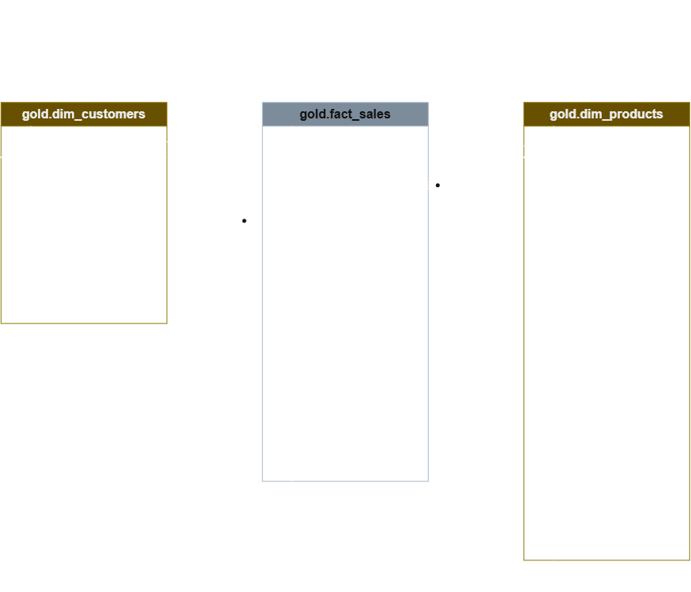
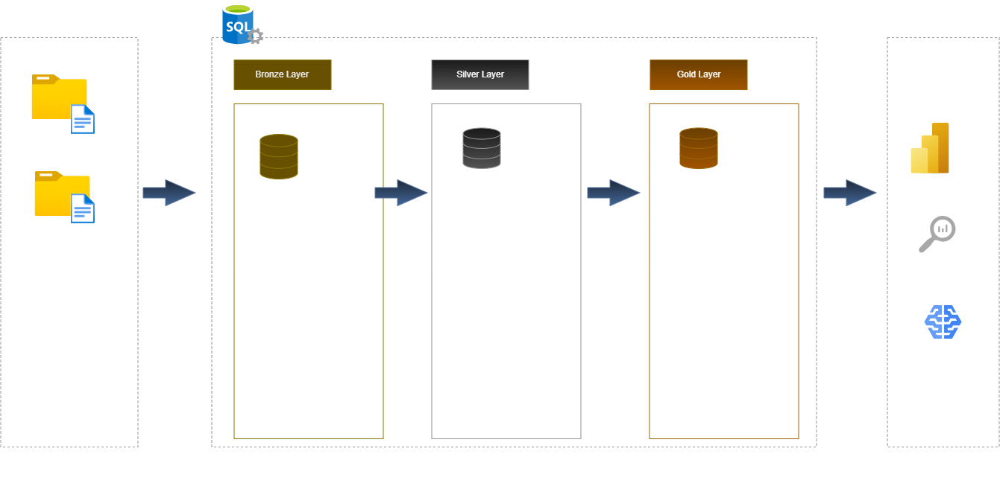

# SQL Data Warehouse & Analytics Project

## 📌 Project Overview

This project was completed as part of my **SQL training** and is based on the **SQL Data Warehouse Project by Data With Baraa**.

The project provided a hands-on opportunity to apply SQL concepts in an end-to-end data warehousing environment, including data ingestion, data cleansing, transformation, data modeling, and analytical querying.

The main objective was to develop practical experience with SQL and understand how raw data from different source systems can be transformed into a structured and business-ready data warehouse.

> **Course Project / Learning Project**
> This repository documents my implementation of a project completed during my SQL training. The original project concept, structure, and learning materials were created by **Data With Baraa**.

🔗 **Original Project:**
https://github.com/DataWithBaraa/sql-data-warehouse-project

---

## 🎯 Project Objectives

The main objectives of this project were to:

* Build a modern SQL-based data warehouse
* Work with raw ERP and CRM data
* Implement data ingestion and transformation processes
* Clean and standardize raw data
* Implement Bronze, Silver, and Gold layers
* Design a dimensional data model
* Create fact and dimension tables
* Develop analytical SQL queries
* Perform data quality checks
* Generate business-oriented insights from the transformed data

---

## 🏗️ Data Warehouse Architecture

The project follows a **Medallion Architecture** consisting of three layers:

### 🥉 Bronze Layer

The Bronze layer contains the raw data imported from the source systems.

**Purpose:**

* Load raw source data
* Preserve the original information
* Provide a foundation for further transformation

### 🥈 Silver Layer

The Silver layer focuses on data cleansing and transformation.

**Main activities:**

* Data cleansing
* Data standardization
* Handling inconsistent values
* Data type transformations
* Removing duplicates
* Preparing data for analytical use

### 🥇 Gold Layer

The Gold layer contains business-ready data structured for analytics.

**Main activities:**

* Creating fact and dimension tables
* Implementing a star schema
* Preparing data for analytical queries
* Supporting business-oriented analysis

---

## 🔄 ETL Process

The project demonstrates an end-to-end ETL workflow:

```text
Raw Source Data
      │
      ▼
┌─────────────┐
│ Bronze Layer│
│ Raw Data    │
└──────┬──────┘
       │
       ▼
┌─────────────┐
│ Silver Layer│
│ Clean &     │
│ Transform   │
└──────┬──────┘
       │
       ▼
┌─────────────┐
│ Gold Layer  │
│ Business-   │
│ Ready Data  │
└──────┬──────┘
       │
       ▼
   Analytics
```

---

## 🗂️ Data Sources

The project works with data originating from two main source systems:

* **CRM** – Customer Relationship Management
* **ERP** – Enterprise Resource Planning

The source data contains information related to customers, products, sales, and other business processes.

The data is initially loaded in its raw form and subsequently transformed through the Bronze, Silver, and Gold layers.

---

## 🧩 Data Modeling

A dimensional data model was developed for the Gold layer to support analytical queries.

The model follows a **Star Schema** consisting of:

* Fact tables containing measurable business events
* Dimension tables providing descriptive business context

The data model was recreated by me using **Draw.io** based on the project requirements and architecture introduced during the training.

### Data Model



---

## 🏛️ Data Architecture

The overall data warehouse architecture was also recreated by me in **Draw.io** as part of the project implementation.

### Data Warehouse Architecture



---

## 🛠️ Tools & Technologies

The following tools and technologies were used:

| Tool / Technology                       | Purpose                                    |
| --------------------------------------- | ------------------------------------------ |
| **SQL Server**                          | Database management and data warehousing   |
| **T-SQL**                               | Data transformation and analytical queries |
| **SQL Server Management Studio (SSMS)** | SQL development and database management    |
| **Git & GitHub**                        | Version control and project documentation  |
| **Draw.io**                             | Data architecture and data modeling        |

---

## 💻 SQL Skills Demonstrated

This project provided practical experience with a range of SQL concepts and techniques, including:

* SELECT statements
* Filtering and sorting
* Aggregations
* GROUP BY
* CASE statements
* JOINs
* Subqueries
* Common Table Expressions (CTEs)
* Window Functions
* Temporary Tables
* Views
* Stored Procedures
* Data Cleaning
* Data Transformation
* Data Validation
* ETL Processes
* Dimensional Data Modeling
* Analytical SQL

---

## 🔍 Data Quality & Transformation

A key part of the project was preparing raw data for analytical use.

The transformation process included:

* Identifying and handling missing values
* Detecting duplicate records
* Standardizing inconsistent data
* Converting data types
* Validating business rules
* Applying data cleansing logic
* Transforming source data into structured analytical tables

These steps helped ensure that the final Gold layer provides a consistent and reliable basis for analysis.

---

## 📊 Analytical Layer

The Gold layer provides business-ready datasets that can be used to answer analytical questions such as:

* Which products generate the highest sales?
* Which customers contribute most to overall revenue?
* How does sales performance change over time?
* Which product categories perform best?
* What are the key characteristics of customers and sales activity?

The project demonstrates how SQL can be used not only for data manipulation, but also to transform raw operational data into information that supports business analysis.

---

## 📁 Repository Structure

```text
sql-data-warehouse-course-project/
│
├── datasets/
│   └── source_crm
│   │   └── cust_info.csv
│   │   └── prd_info.csv
│   │   └── sales_details.csv
│   └── source_erp
│   │   └── cust_az12.csv
│   │   └── loc_a101.csv
│   │   └── px_cat_g1v2.csv
│
├── docs/
│   ├── data_architecture.png
│   ├── data_flow.png
│   └── data_model_star-schema.png
│   └── data_integration.png
│   └── data_catalog.md
│
├── scripts/
│   ├── bronze/
│   │   └── ddl_bronze.sql
│   │   └── proc_load_bronze.sql
│   │
│   ├── silver/
│   │   └── ddl_silver.sql
│   │   └── proc_load_silver.sql
│   │
│   └── gold/
│       └── ddl_gold.sql
│   └── init_database.sql
│
├── tests/
│   └── quality_checks_silver.sql
│   └── quality_checks_gold.sql
│
└── README.md
```

---

## 🎓 Learning Outcomes

Completing this project helped me strengthen my practical understanding of SQL and data warehousing concepts.

In particular, I gained experience in:

* Designing and understanding data warehouse architectures
* Working with multiple source systems
* Building ETL workflows using SQL
* Cleaning and transforming raw data
* Designing dimensional data models
* Creating analytical datasets
* Performing data quality checks
* Writing structured and reusable SQL code
* Understanding the relationship between data engineering and data analytics

The project also helped me understand how SQL fits into a broader data analytics and business intelligence workflow.

---

## 🙏 Credits & Attribution

This project was completed as part of my **SQL training** and is based on the educational project created by **Data With Baraa**.

I would like to give full credit to **Data With Baraa** for the original project concept, project structure, learning materials, and guidance that formed the basis of this learning project.

🔗 **Original GitHub Repository:**
https://github.com/DataWithBaraa/sql-data-warehouse-project

🔗 **Data With Baraa:**
https://www.datawithbaraa.com/

This repository represents my implementation and documentation of the project as part of my SQL training and portfolio development.

The **data architecture and data model diagrams in this repository were recreated independently by me using Draw.io** based on the concepts and requirements presented in the training.

---

## 📚 Source & Inspiration

**Data With Baraa – SQL Data Warehouse Project**

https://github.com/DataWithBaraa/sql-data-warehouse-project

The original project served as the learning foundation for this implementation.

---

## 📌 Disclaimer

This repository is intended for **educational and portfolio purposes**.

The project should be viewed in the context of my SQL training and learning journey. Credit for the original project concept and educational materials belongs to **Data With Baraa**.
